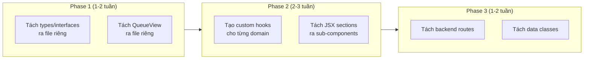
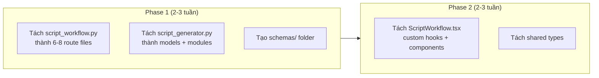
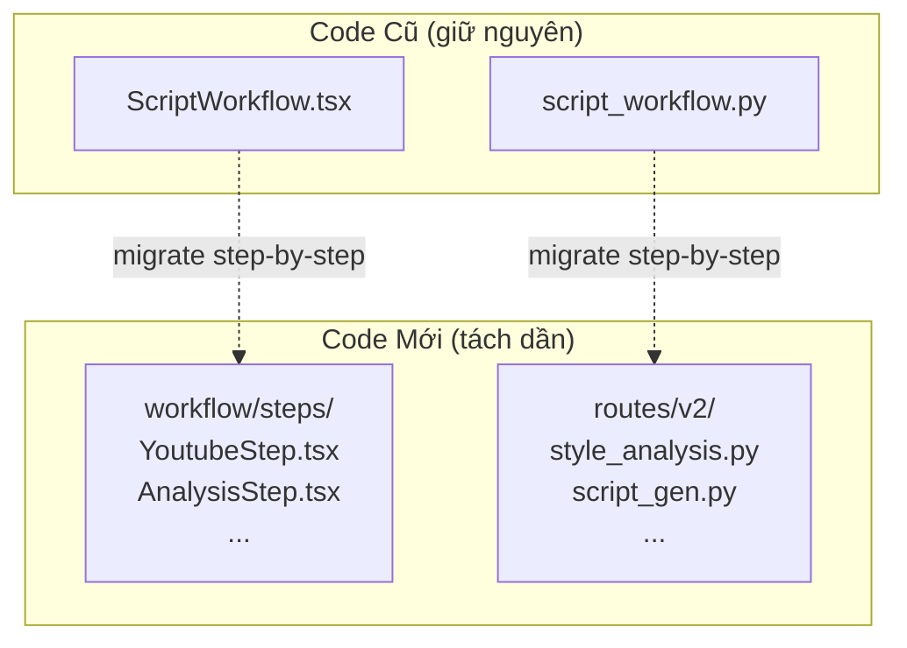

# 🧠 Brainstorm: Refactoring RenmaeAI Studio

## Bối Cảnh

Codebase hiện tại có **3 file "khổng lồ"** (God Files) chiếm phần lớn logic ứng dụng, gây khó khăn cho maintenance, debugging và onboarding. Cần chiến lược refactor an toàn và hiệu quả.

### Bản Đồ "Nợ Kỹ Thuật" (Technical Debt Map)

| File | Dòng | Items | Vấn đề chính |
|------|------|-------|--------------|
| [ScriptWorkflow.tsx](file:///c:/Users/letha/OneDrive/Desktop/sonlt/renmaeai/src/components/workflow/ScriptWorkflow.tsx) | **10,800** | 67 functions | God Component — chứa mọi thứ từ UI đến business logic |
| [script_workflow.py](file:///c:/Users/letha/OneDrive/Desktop/sonlt/renmaeai/backend/routes/script_workflow.py) | **5,895** | 136 items | God Route — tất cả API endpoints trong 1 file |
| [script_generator.py](file:///c:/Users/letha/OneDrive/Desktop/sonlt/renmaeai/backend/modules/script_generator.py) | **5,300** | 73 items | God Module — AI logic, data classes, template mgmt |
| [PresetSection.tsx](file:///c:/Users/letha/OneDrive/Desktop/sonlt/renmaeai/src/components/workflow/PresetSection.tsx) | 1,629 | 29 items | Quá nhiều props drilling, types nội tuyến |
| [ProductionHub.tsx](file:///c:/Users/letha/OneDrive/Desktop/sonlt/renmaeai/src/components/workflow/ProductionHub.tsx) | 1,084 | 55 items | Columns hardcoded, logic trộn lẫn UI |
| [QueueSidebar.tsx](file:///c:/Users/letha/OneDrive/Desktop/sonlt/renmaeai/src/components/workflow/QueueSidebar.tsx) | 999 | 9 items | Type definitions dài 50+ dòng inline |
| [App.tsx](file:///c:/Users/letha/OneDrive/Desktop/sonlt/renmaeai/src/App.tsx) | 951 | 8 items | Navigation + Layout + Auth gộp chung |

---

## Phân Tích Chi Tiết Từng "God File"

### 1. [ScriptWorkflow.tsx](file:///c:/Users/letha/OneDrive/Desktop/sonlt/renmaeai/src/components/workflow/ScriptWorkflow.tsx) — 10,800 dòng 🔴

```mermaid
graph TB
    SW["ScriptWorkflow\n(10,800 lines)"]
    
    SW --> G1["🎬 YouTube Extract\n~200 lines"]
    SW --> G2["📝 Style Analysis\n~500 lines"]
    SW --> G3["✍️ Script Generation\n~600 lines"]
    SW --> G4["🔀 Scene Splitting\n~400 lines"]
    SW --> G5["🔑 Keyword Generation\n~300 lines"]
    SW --> G6["🔍 Footage Search\n~600 lines"]
    SW --> G7["🗣️ Voice/TTS\n~500 lines"]
    SW --> G8["🎥 Video Assembly\n~300 lines"]
    SW --> G9["💾 Project Save/Load\n~400 lines"]
    SW --> G10["🎨 Style Profiles\n~300 lines"]
    SW --> G11["⚙️ Preset Config\n~400 lines"]
    SW --> G12["📊 SEO\n~200 lines"]
    SW --> QV["QueueView\n(~2000 lines — component riêng\nnhưng nằm cùng file!)"]
    SW --> G13["🖼️ Image Handlers\n~100 lines"]
    SW --> JSX["JSX Render\n~4,800 lines"]
    
    style SW fill:#ff4444,color:white
    style QV fill:#ff8800,color:white
    style JSX fill:#ff6666,color:white
```



**Các nhóm function chính cần tách:**

| Nhóm | Functions | Dòng ước tính | Đề xuất tách thành |
|------|-----------|--------------|-------------------|
| YouTube Extract | [handleExtractYoutubeUrl](file:///c:/Users/letha/OneDrive/Desktop/sonlt/renmaeai/src/components/workflow/ScriptWorkflow.tsx#2286-2400), [handleRemoveYoutubeItem](file:///c:/Users/letha/OneDrive/Desktop/sonlt/renmaeai/src/components/workflow/ScriptWorkflow.tsx#2401-2436) | ~150 | `hooks/useYoutubeExtract.ts` |
| Style Analysis | [handleAnalyzeMultipleStyles](file:///c:/Users/letha/OneDrive/Desktop/sonlt/renmaeai/src/components/workflow/ScriptWorkflow.tsx#2440-2694), [handleStopAnalysis](file:///c:/Users/letha/OneDrive/Desktop/sonlt/renmaeai/src/components/workflow/ScriptWorkflow.tsx#2699-2729) | ~300 | `hooks/useStyleAnalysis.ts` |
| Script Generation | [handleAdvancedRemakeConversation](file:///c:/Users/letha/OneDrive/Desktop/sonlt/renmaeai/src/components/workflow/ScriptWorkflow.tsx#2740-2925), [handleStopScriptGeneration](file:///c:/Users/letha/OneDrive/Desktop/sonlt/renmaeai/src/components/workflow/ScriptWorkflow.tsx#2930-2941), `handleCopy/Download` | ~250 | `hooks/useScriptGeneration.ts` |
| Scene Management | [handleSplitToScenes](file:///c:/Users/letha/OneDrive/Desktop/sonlt/renmaeai/src/components/workflow/ScriptWorkflow.tsx#2984-3125), [handleResetScenes](file:///c:/Users/letha/OneDrive/Desktop/sonlt/renmaeai/src/components/workflow/ScriptWorkflow.tsx#3134-3153), [handleToggleVoiceExport](file:///c:/Users/letha/OneDrive/Desktop/sonlt/renmaeai/src/components/workflow/ScriptWorkflow.tsx#3156-3165), `handleCopy/Download` | ~250 | `hooks/useSceneManagement.ts` |
| Keyword Generation | [handleGenerateKeywords](file:///c:/Users/letha/OneDrive/Desktop/sonlt/renmaeai/src/components/workflow/ScriptWorkflow.tsx#3304-3503), [handleStopKeywordGeneration](file:///c:/Users/letha/OneDrive/Desktop/sonlt/renmaeai/src/components/workflow/ScriptWorkflow.tsx#3508-3519), [handleAnalyzeContext](file:///c:/Users/letha/OneDrive/Desktop/sonlt/renmaeai/src/components/workflow/ScriptWorkflow.tsx#3258-3301) | ~300 | `hooks/useKeywordGeneration.ts` |
| Footage | [handleSearchFootageBatch](file:///c:/Users/letha/OneDrive/Desktop/sonlt/renmaeai/src/components/workflow/ScriptWorkflow.tsx#544-649), [handleSearchFootageForScene](file:///c:/Users/letha/OneDrive/Desktop/sonlt/renmaeai/src/components/workflow/ScriptWorkflow.tsx#654-675), [handleGenerateVideoFootage](file:///c:/Users/letha/OneDrive/Desktop/sonlt/renmaeai/src/components/workflow/ScriptWorkflow.tsx#690-1107), [handleStop](file:///c:/Users/letha/OneDrive/Desktop/sonlt/renmaeai/src/components/workflow/ScriptWorkflow.tsx#2699-2729) | ~600 | `hooks/useFootageSearch.ts` |
| Voice/TTS | [handleGenerateVoice](file:///c:/Users/letha/OneDrive/Desktop/sonlt/renmaeai/src/components/workflow/ScriptWorkflow.tsx#3652-3711), [handleGenerateBatchVoice](file:///c:/Users/letha/OneDrive/Desktop/sonlt/renmaeai/src/components/workflow/ScriptWorkflow.tsx#3716-3901), [handleRetryFailed](file:///c:/Users/letha/OneDrive/Desktop/sonlt/renmaeai/src/components/workflow/ScriptWorkflow.tsx#3922-4081), [handleDownloadAll](file:///c:/Users/letha/OneDrive/Desktop/sonlt/renmaeai/src/components/workflow/ScriptWorkflow.tsx#4086-4117), [handlePlay](file:///c:/Users/letha/OneDrive/Desktop/sonlt/renmaeai/src/components/workflow/ScriptWorkflow.tsx#4122-4163) | ~500 | `hooks/useVoiceGeneration.ts` |
| Video Assembly | [handleAssembleVideo](file:///c:/Users/letha/OneDrive/Desktop/sonlt/renmaeai/src/components/workflow/ScriptWorkflow.tsx#1114-1269) | ~160 | `hooks/useVideoAssembly.ts` |
| Project Persistence | [autoSaveProject](file:///c:/Users/letha/OneDrive/Desktop/sonlt/renmaeai/src/components/workflow/ScriptWorkflow.tsx#1730-1783), [loadSavedProjects](file:///c:/Users/letha/OneDrive/Desktop/sonlt/renmaeai/src/components/workflow/ScriptWorkflow.tsx#1392-1425), [loadSavedStyles](file:///c:/Users/letha/OneDrive/Desktop/sonlt/renmaeai/src/components/workflow/ScriptWorkflow.tsx#1356-1385), [loadTemplates](file:///c:/Users/letha/OneDrive/Desktop/sonlt/renmaeai/src/components/workflow/ScriptWorkflow.tsx#1438-1453), [loadModels](file:///c:/Users/letha/OneDrive/Desktop/sonlt/renmaeai/src/components/workflow/ScriptWorkflow.tsx#1540-1611) | ~300 | `hooks/useProjectPersistence.ts` |
| Style Profiles | [handleSaveStyle](file:///c:/Users/letha/OneDrive/Desktop/sonlt/renmaeai/src/components/workflow/ScriptWorkflow.tsx#2082-2151), [handleLoadStyle](file:///c:/Users/letha/OneDrive/Desktop/sonlt/renmaeai/src/components/workflow/ScriptWorkflow.tsx#2156-2185), [handleDeleteStyle](file:///c:/Users/letha/OneDrive/Desktop/sonlt/renmaeai/src/components/workflow/ScriptWorkflow.tsx#2190-2231), [handleRenameStyle](file:///c:/Users/letha/OneDrive/Desktop/sonlt/renmaeai/src/components/workflow/ScriptWorkflow.tsx#2236-2283) | ~200 | `hooks/useStyleProfiles.ts` |
| JSX Sections | 4,800 dòng render | ~4800 | Tách component con |
| QueueView | Component riêng nhưng gộp trong file | ~2000 | `components/workflow/QueueView.tsx` |

---

### 2. [script_workflow.py](file:///c:/Users/letha/OneDrive/Desktop/sonlt/renmaeai/backend/routes/script_workflow.py) — 5,895 dòng 🔴

**136 items gồm các nhóm:**

| Nhóm | Endpoints | Đề xuất file |
|------|-----------|-------------|
| Style Analysis | `analyze_to_style_a`, streaming variants | `routes/style_analysis.py` |
| Script Generation | [advanced_full_pipeline_conversation](file:///c:/Users/letha/OneDrive/Desktop/sonlt/renmaeai/backend/routes/script_workflow.py#475-540), SSE | `routes/script_generation.py` |
| Scene Management | [split_script_to_scenes](file:///c:/Users/letha/OneDrive/Desktop/sonlt/renmaeai/backend/routes/script_workflow.py#553-624), [clean_scenes](file:///c:/Users/letha/OneDrive/Desktop/sonlt/renmaeai/backend/routes/script_workflow.py#632-704), language detection | `routes/scene_management.py` |
| Keyword/Context | [analyze_scene_context](file:///c:/Users/letha/OneDrive/Desktop/sonlt/renmaeai/backend/routes/script_workflow.py#1184-1268), concept analysis | `routes/keyword_context.py` |
| Style Profiles | CRUD (save/load/update/delete/toggle) | `routes/style_profiles.py` |
| Templates | [get_templates](file:///c:/Users/letha/OneDrive/Desktop/sonlt/renmaeai/backend/routes/script_workflow.py#246-252), [get_template_by_id](file:///c:/Users/letha/OneDrive/Desktop/sonlt/renmaeai/backend/routes/script_workflow.py#254-273) | `routes/templates.py` |
| Request/Response | ~20 Pydantic models | `schemas/script_workflow.py` |
| Shared Helpers | [get_configured_ai_client](file:///c:/Users/letha/OneDrive/Desktop/sonlt/renmaeai/backend/routes/script_workflow.py#86-211), [_get_user_email_from_request](file:///c:/Users/letha/OneDrive/Desktop/sonlt/renmaeai/backend/routes/script_workflow.py#32-51), language maps | `routes/helpers.py` |

---

### 3. [script_generator.py](file:///c:/Users/letha/OneDrive/Desktop/sonlt/renmaeai/backend/modules/script_generator.py) — 5,300 dòng 🟡

| Nhóm | Classes/Functions | Đề xuất file |
|------|------------------|-------------|
| Data Classes | [StyleProfile](file:///c:/Users/letha/OneDrive/Desktop/sonlt/renmaeai/backend/modules/script_generator.py#33-66), [StyleA](file:///c:/Users/letha/OneDrive/Desktop/sonlt/renmaeai/backend/modules/script_generator.py#122-241), [DraftSection](file:///c:/Users/letha/OneDrive/Desktop/sonlt/renmaeai/backend/modules/script_generator.py#73-84), [DetailedStyleAnalysis](file:///c:/Users/letha/OneDrive/Desktop/sonlt/renmaeai/backend/modules/script_generator.py#86-99), [ScriptStructure](file:///c:/Users/letha/OneDrive/Desktop/sonlt/renmaeai/backend/modules/script_generator.py#105-120) | `models/style_models.py` |
| Advanced Workflow | [OriginalScriptAnalysis](file:///c:/Users/letha/OneDrive/Desktop/sonlt/renmaeai/backend/modules/script_generator.py#247-276) + 6 step classes | `models/workflow_models.py` |
| Style Analyzer | `ConversationStyleAnalyzer` class | `modules/style_analyzer.py` |
| Advanced Remake | `AdvancedRemakeWorkflow` class | `modules/advanced_remake.py` |
| Template Logic | `list_templates`, [get_template](file:///c:/Users/letha/OneDrive/Desktop/sonlt/renmaeai/backend/routes/script_workflow.py#246-252), `SCRIPT_TEMPLATES` | `modules/template_manager.py` |

---

## Chiến Lược Refactor

### Option A: Bottom-Up (Tách Hooks trước) 🎯

Bắt đầu từ Frontend, tách logic ra custom hooks, giữ UI component ổn định.



✅ **Pros:**
- Rủi ro thấp — từng bước nhỏ, dễ test
- Không thay đổi behavior, chỉ di chuyển code
- Frontend thay đổi không ảnh hưởng backend
- Có thể dừng bất kỳ lúc nào mà code vẫn ổn

❌ **Cons:**
- Mất thời gian hơn do tiếp cận từng bước
- Có thể gây duplicate imports tạm thời
- Backend (nợ kỹ thuật lớn hơn) được xử lý cuối

📊 **Effort:** Medium-High (5-7 tuần)

---

### Option B: Top-Down (Tách Backend trước) 🏗️

Refactor backend routes & modules trước, sau đó frontend.



✅ **Pros:**
- Xử lý phần "nợ" nghiêm trọng nhất trước (backend 5,300 + 5,900 = 11,200 dòng)
- API contract không đổi → Frontend không bị ảnh hưởng
- Dễ viết unit test cho backend modules riêng lẻ
- Kiến trúc backend rõ ràng hơn cho feature mới

❌ **Cons:**
- Cần hiểu sâu FastAPI router patterns
- Có thể gây regression nếu import sai
- Frontend (phần user đối mặt trực tiếp) phải chờ

📊 **Effort:** Medium-High (4-6 tuần)

---

### Option C: Strangler Fig (Tách module mới, deprecated module cũ) 🌳

Viết module mới cho từng feature, từ từ deprecated code cũ.



✅ **Pros:**
- Zero risk — code cũ không bị sửa đổi
- Có thể A/B test giữa code cũ và mới
- Không cần refactor tất cả cùng lúc
- Mỗi module mới có thể viết test trước khi dùng

❌ **Cons:**
- Duplicate code tạm thời (tăng size dự án)
- Cần maintained 2 phiên bản trong thời gian chuyển đổi
- Phức tạp hóa dependency management
- Thời gian hoàn thành lâu nhất

📊 **Effort:** High (6-10 tuần)

---

## Đề Xuất Cấu Trúc Thư Mục Sau Refactor

````carousel
### Frontend — Trước và Sau

```
# TRƯỚC
src/
├── components/workflow/
│   ├── ScriptWorkflow.tsx     (10,800 lines 🔴)
│   ├── PresetSection.tsx      (1,629 lines)
│   ├── ProductionHub.tsx      (1,084 lines)
│   ├── QueuePanel.tsx         (700 lines)
│   └── QueueSidebar.tsx       (999 lines)
├── stores/ (7 files)
└── lib/api.ts                 (75KB)
```

```
# SAU
src/
├── components/workflow/
│   ├── ScriptWorkflow.tsx     (~800 lines ✅ — orchestrator only)
│   ├── QueueView.tsx          (~1500 lines — extracted)
│   ├── steps/
│   │   ├── YoutubeImport.tsx
│   │   ├── StyleAnalysis.tsx
│   │   ├── ScriptEditor.tsx
│   │   ├── SceneManager.tsx
│   │   ├── KeywordPanel.tsx
│   │   ├── FootagePanel.tsx
│   │   ├── VoicePanel.tsx
│   │   └── VideoAssembly.tsx
│   ├── PresetSection.tsx
│   ├── ProductionHub.tsx
│   ├── QueuePanel.tsx
│   └── QueueSidebar.tsx
├── hooks/workflow/
│   ├── useYoutubeExtract.ts
│   ├── useStyleAnalysis.ts
│   ├── useScriptGeneration.ts
│   ├── useSceneManagement.ts
│   ├── useKeywordGeneration.ts
│   ├── useFootageSearch.ts
│   ├── useVoiceGeneration.ts
│   ├── useVideoAssembly.ts
│   ├── useProjectPersistence.ts
│   └── useStyleProfiles.ts
├── types/
│   ├── workflow.ts
│   ├── pipeline.ts
│   └── preset.ts
├── stores/ (7 files — giữ nguyên)
└── lib/api.ts (75KB — tách sau nếu cần)
```
<!-- slide -->
### Backend — Trước và Sau

```
# TRƯỚC
backend/
├── routes/
│   ├── script_workflow.py     (5,895 lines 🔴)
│   └── ... (15 files khác)
├── modules/
│   ├── script_generator.py    (5,300 lines 🔴)
│   └── ... (26 files khác)
└── (no schemas/, no models/)
```

```
# SAU
backend/
├── routes/
│   ├── style_analysis.py      (~400 lines)
│   ├── script_generation.py   (~500 lines)
│   ├── scene_management.py    (~500 lines)
│   ├── keyword_context.py     (~300 lines)
│   ├── style_profiles.py      (~200 lines)
│   ├── templates.py           (~100 lines)
│   └── ... (15 files khác - giữ nguyên)
├── schemas/
│   ├── script_workflow.py     (~100 lines — Pydantic models)
│   └── ...
├── modules/
│   ├── style_analyzer.py      (~800 lines)
│   ├── advanced_remake.py     (~1500 lines)
│   ├── template_manager.py    (~200 lines)
│   └── ... (26 files khác - giữ nguyên)
├── models/
│   ├── style_models.py        (~200 lines)
│   └── workflow_models.py     (~300 lines)
└── utils/ (giữ nguyên)
```
````

---

## 💡 Recommendation

**Option A: Bottom-Up** — vì:

1. **Rủi ro thấp nhất** — Frontend hooks chỉ là "move code", không thay đổi behavior
2. **Thấy kết quả nhanh** — [ScriptWorkflow.tsx](file:///c:/Users/letha/OneDrive/Desktop/sonlt/renmaeai/src/components/workflow/ScriptWorkflow.tsx) 10,800 → ~800 dòng chỉ sau Phase 2
3. **Không cần test backend** — API contract giữ nguyên hoàn toàn
4. **Phù hợp dự án 1 người** — Có thể dừng bất kỳ lúc nào

### Ưu tiên thực hiện

| Step | Hành động | Risk | Impact |
|------|-----------|------|--------|
| 1 | Tách `types/workflow.ts` từ inline types | 🟢 Rất thấp | Giảm duplicate |
| 2 | Tách [QueueView](file:///c:/Users/letha/OneDrive/Desktop/sonlt/renmaeai/src/components/workflow/ScriptWorkflow.tsx#8855-10799) ra file riêng | 🟢 Thấp | -2,000 dòng |
| 3 | Tạo custom hooks (10 hooks) | 🟡 Trung bình | -4,000 dòng |
| 4 | Tách JSX sections ra sub-components | 🟡 Trung bình | -3,000 dòng |
| 5 | Tách backend routes | 🟡 Trung bình | Code backend sạch |
| 6 | Tách [script_generator.py](file:///c:/Users/letha/OneDrive/Desktop/sonlt/renmaeai/backend/modules/script_generator.py) | 🟡 Trung bình | Module rõ ràng |

Bạn muốn bắt tay vào step nào, hay cần phân tích sâu hơn phần nào?
