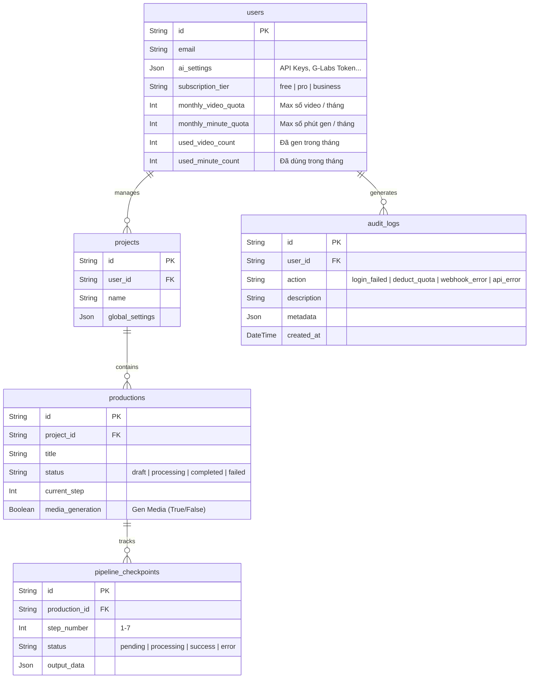
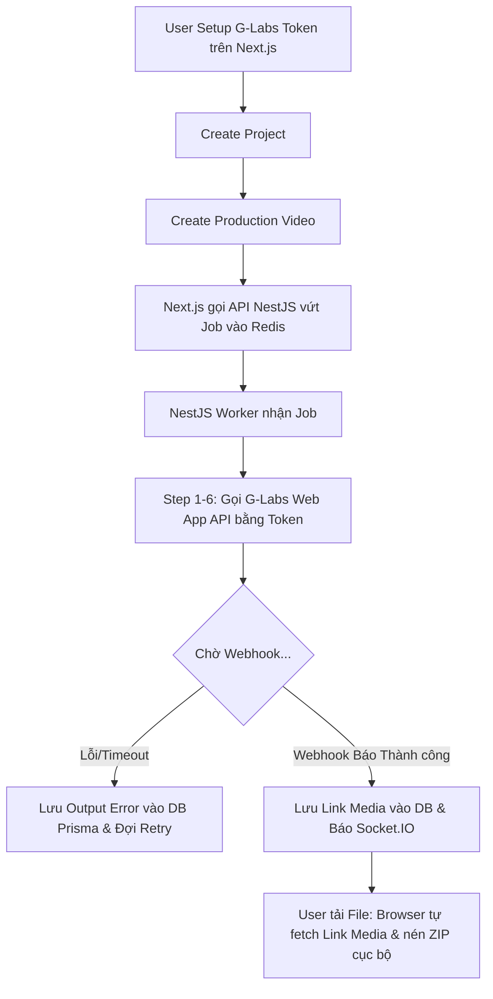

# Product Specification: RenmaeAI SaaS v2

## 1. Executive Summary
RenmaeAI v2 là một web-based SaaS platform tự động hóa sản xuất video hướng đến các Content Creator và Agency. Nền tảng chuyển đổi từ ứng dụng Desktop cục bộ (v1) sang kiến trúc Enterprise Cloud-native tự host bằng Docker Compose trên VPS.
Kiến trúc sử dụng **Next.js** (Frontend) kết hợp **NestJS** (Backend) và **Prisma ORM** (Database). Hệ thống sử dụng mô hình 100% BYOK thông qua việc tích hợp Token từ Web App của đối tác (Flow2API, G-Labs-Automation). Xử lý tác vụ media nặng (Đo đạc Audio, Cắt/Ghép Video, Nén ZIP) được đẩy hoàn toàn về Client-side (Trình duyệt thông qua `ffmpeg.wasm`) để tối ưu 100% chi phí CPU/Băng thông cho máy chủ.

## 2. User Stories
- **Là một Content Creator**, tôi muốn dán kịch bản vào web để hệ thống tự động sinh ảnh, ghép giọng đọc thành một bộ Resource hoàn chỉnh.
- **Là một Agency**, tôi muốn chạy 10 dự án video cùng lúc (Concurrent Pipelines) để kịp giao số lượng lớn cho khách hàng.
- **Là một "Dân cày" mmo**, tôi muốn dán mã Token từ tài khoản G-Labs Web App của tôi vào hệ thống, để tôi sử dụng nguồn tài nguyên ảnh/video không giới hạn của riêng mình.
- **Là một người dùng linh hoạt**, tôi muốn có tuỳ chọn "Chỉ Gen Prompt & Script" (không gen ảnh/video) để mang đi UI khác dùng, giúp tôi tiết kiệm số phút (Quota) hàng tháng.
- **Là một người dùng trả phí**, tôi muốn sau khi hệ thống chạy xong, tôi chỉ cần bấm nút "Tải ZIP" để nén file rời, hoặc "Tải Video Ghép Sẵn" để Trình duyệt tự động dùng Card Đồ họa của tôi ghép Audio và Video lại với nhau trong tíc tắc.

## 3. Database Design (ERD High-Level)
*Quản lý bằng Prisma ORM. Frontend (NextAuth) và Backend (NestJS) cùng chia sẻ một chung một Database PostgreSQL.*

## 4. Logic Flowchart (Webhooks & Quota)

## 5. API Contract (High Level)
*(Quản lý bởi NestJS, được chứng thực bằng JWT Header Token)*
- `POST /api/v1/projects`: Tạo dự án mới
- `POST /api/v1/productions`: Tạo video thuộc dự án
- `POST /api/v1/pipelines/start`: Đẩy Job vào Queue BullMQ
- `POST /api/v1/webhooks/flow2api`: Trạm thu Callback kết quả từ G-Labs
- `GET /api/v1/pipelines/:id/progress`: Socket.IO endpoint cập nhật UI Realtime cho Next.js

## 6. UI Components (Next.js App Router)
- **Layout:** Sidebar menu bên trái, Top-bar hiển thị số luồng đang chạy.
- **Kanban Pipeline:** Hiển thị 7 cột tiến độ của Video.
- **Settings:** BYOK Configuration. Form nhập Token Web App G-Labs.
- **Downloader & Muxer:** Hook JSZip bắt sự kiện tải nén tệp tin tĩnh (Media URLs) từ trình duyệt. Sử dụng Web Worker chạy `ffmpeg.wasm` để đo độ dài tập tin Audio, cắt bỏ phần thừa của Video và Muxing (Trộn) lại thành MP4 hoàn chỉnh phiá người dùng.
- **Admin Backoffice (Log UI):** Trang dành riêng cho Admin (role=admin) để tìm kiếm, lọc và phân tích `audit_logs` từ Database trực quan (Không cần mở file text).

## 7. Scheduled Tasks (Cron Jobs)
- Reset `used_video_count` và `used_minute_count` vào mùng 1 đầu tháng.
- Sync trạng thái gia hạn thẻ tín dụng từ Polar webhooks.

## 8. Third-party Integrations
- **NextAuth.js (Auth.js):** Quản lý phiên đăng nhập cho Next.js, lưu session vào Prisma.
- **Polar.sh:** Xử lý thanh toán Subscriptions đa quốc gia.
- **Third-Party AI Endpoint:** Flow2API, Web App G-Labs Automation.

## 9. Hidden Requirements (Logic Nghẽn)
- **Client-Side ZIP & Muxing (Chống nghẽn Server):** Trình duyệt của User (Next.js Client) sử dụng `jszip` và `ffmpeg.wasm` để fetch trực tiếp từ nguồn Gen (Veo3/Midjourney/Flow2API/ElevenLabs). Browser sẽ đo độ dài Audio, cắt video Veo3 cho khớp và tự nén ra file cục bộ tại máy User. VPS băng thông/Media CPU = 0.
- **Webhook Callback Reliability:** NestJS không request "chờ" (await 5 phút). Nó chỉ bắn Request API khởi tạo tới G-Labs (kèm `callback_url`), sau đó giải phóng Worker. Khi G-Labs làm xong sẽ POST ngược về Webhook của NestJS để báo Socket.IO.
- **Redis Cleanup (Memory Leak):** Cấu hình BullMQ dọn sạch các Job đã hoàn thành `removeOnComplete: true` ra khỏi RAM. Chỉ giữ lại 100 Job lỗi gần nhất `removeOnFail: 100`. Lịch sử được lưu ở Prisma PostgreSQL.
- **Anti-Spam (Rate Limiting):** Sử dụng `@nestjs/throttler` bảo vệ API Backend khỏi bị spam request tống rác vào Queue.
- **Trừ Quota & Logic Concurrent Slot:** 
  - Gói Pro có 3 Slot chạy đồng thời (Concurrent). Nếu đăng nhập nhiều nơi, hệ thống chặn dựa trên Slot này (Ai bấm trước chạy trước, ai bấm sau phải đợi).
  - Tác vụ "Chỉ Gen Prompt" (media_generation = false) vẫn chiếm 1 Slot khi chạy, nhưng do sinh chữ cực nhanh (2-5 giây), Slot sẽ được **giải phóng ngay lập tức**, không làm nghẽn người dùng chung Account. Chỉ trừ số lượng Video, KHÔNG trừ phút.

## 10. Tech Stack & Infrastructure
- Kiến trúc Codebase: **100% Khởi tạo code sạch từ CLI Base** (Không sử dụng Boilerplate clone).
- Mô hình Deploy: **Docker Compose 100% Self-Hosted trên VPS**
- Frontend: **Next.js 15 (App Router) + TailwindCSS + Shadcn/UI + JSZip + FFmpeg.wasm**
- Backend: **NestJS 11 + Prisma ORM + Socket.IO + Throttler**
- Queue & Cache: **BullMQ + Redis**
- Database: **PostgreSQL 15**
- Quản lý Repository: **Turborepo**
